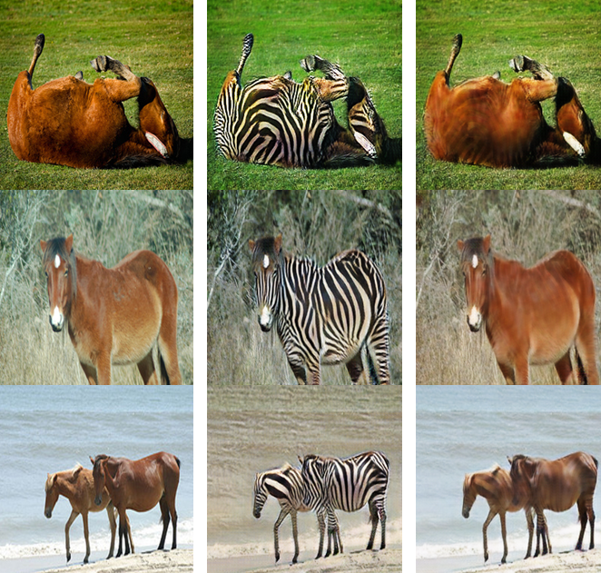

# CycleGAN
Понятная, простая и читабельная реализация CycleGAN на PyTorch. 

## Результаты
Было обучено и успешно конвертированно несколько моделей в формат CoreML.

| 1st column: Исходное изображение / 2nd column: Сгенерированное изображение / 3rd row: Обратная генерация |
|:--------------------------------------------------------------------------------------------------------:|
|                                                                            |


### Датасеты
Comics: [link](https://www.kaggle.com/datasets/defileroff/comic-faces-paired-synthetic)
Anime: [link](https://www.kaggle.com/datasets/dngton/selfie2anime)
Simpson:[link](https://www.kaggle.com/datasets/kostastokis/simpsons-faces)

### Обучение
Отредактируй config.py для настройки перед обучением модели. Обучение в train.py

### Конвертация модели в CoreML
Конвертация модели в conver_to_coreml.py. Необходимо нормализовать последний слой (Tanh) генеративной модели для успешной визуализации генерируемого контента в Swift.

## CycleGAN статья
### Unpaired Image-to-Image Translation using Cycle-Consistent Adversarial Networks by Jun-Yan Zhu, Taesung Park, Phillip Isola, Alexei A. Efros

#### Аннатация
Преобразование изображения в изображение - это класс визуальных и графических задач, целью которых является изучение соответствия между входным и выходным изображениями с использованием обучающего набора пар выровненных изображений. Однако для многих задач парные обучающие данные будут недоступны. Мы представляем подход к обучению переводу изображения из исходной области X в целевую область Y при отсутствии парных примеров. Наша цель состоит в том, чтобы изучить отображение G: X→ Y таким образом, чтобы распределение изображений из G (X) было неотличимо от распределения Y с использованием конкурентных потерь. Поскольку это отображение сильно ограничено, мы соединяем его с обратным отображением F: Y→X и вводим потерю согласованности цикла, чтобы подтолкнуть F(G(X))≈X (и наоборот). Представлены качественные результаты по нескольким задачам, в которых отсутствуют данные для парного обучения, включая передачу стиля коллекции, преобразование объекта, изменение сезона, улучшение фотографий и т.д. Количественные сравнения с несколькими предыдущими методами демонстрируют превосходство нашего подхода.
```
@misc{zhu2020unpaired,
      title={Unpaired Image-to-Image Translation using Cycle-Consistent Adversarial Networks}, 
      author={Jun-Yan Zhu and Taesung Park and Phillip Isola and Alexei A. Efros},
      year={2020},
      eprint={1703.10593},
      archivePrefix={arXiv},
      primaryClass={cs.CV}
}
```
